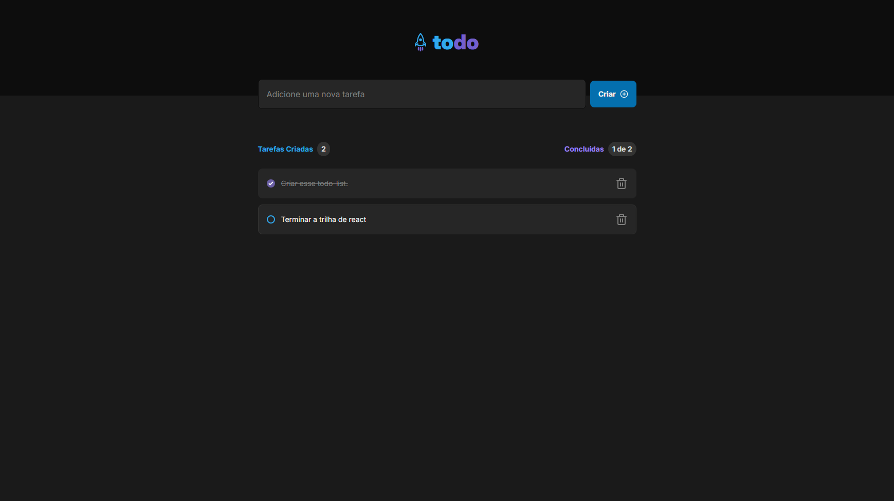

# To-Do List Application

This project is a simple **to-do list** application built with React. The main objective of this project is to reinforce core concepts of React, including state management, immutability, list and key handling, props, and componentization.

## ScreenShot

## Features

-   **Add a new task**: Users can create new tasks and add them to their list.
-   **Mark and unmark tasks as completed**: Users can toggle tasks between completed and not completed states.
-   **Remove tasks from the list**: Users can delete tasks from their list when they are no longer needed.
-   **Show task completion progress**: The application displays the number of tasks completed out of the total tasks.

## Concepts Reinforced

While developing this project, the following concepts are reinforced:

-   **State**: Managing the state of the application to keep track of tasks and their status.
-   **Immutability**: Ensuring that the state is not directly mutated but instead updated in an immutable manner.
-   **Lists and Keys in React**: Rendering lists of tasks and handling unique keys for each task to optimize rendering.
-   **Props**: Passing data and functions to components to manage interactions and state changes.
-   **Componentization**: Breaking down the UI into reusable components to make the code modular and easier to maintain.
